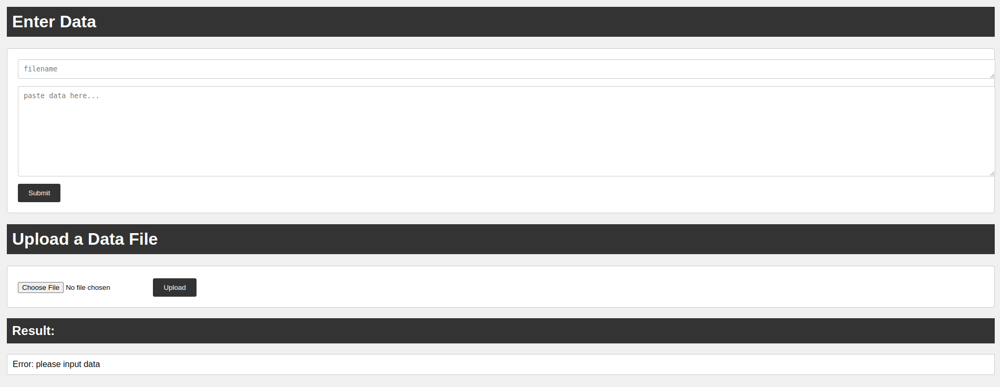

# Easy File Transfer

I threw this together in a few minutes to transfer some data from old devices to my PC quickly. Turned out surprisingly helpful.

## Run

> python3 app.py

You may need to change firewall rules to allow port 5000 too.

## Use

Visit `ip:5000` in a web broswer.

For data: type in a filename and the text data then click `Submit`.
For files: click `Choose File`, select the file, and click `Upload`.

## Example

